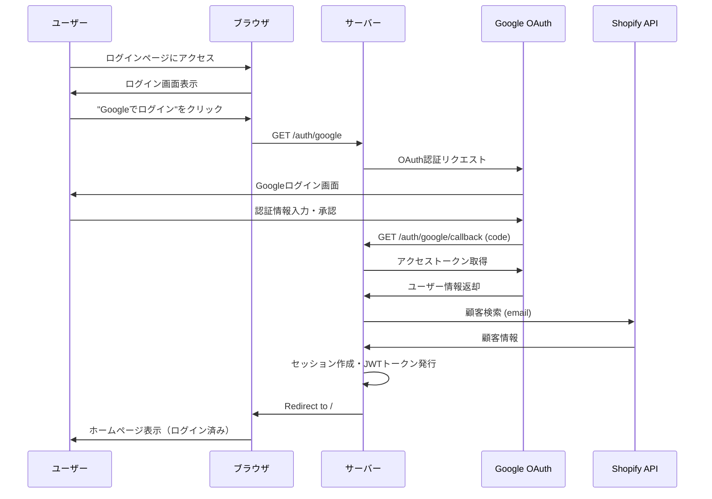

# Google OAuth 2.0 認証設定ガイド

## 概要

このシステムでは、メール認証コードに加えて、Google OAuth 2.0認証をサポートしています。
Googleアカウントでログインすることで、認証コードの入力なしに簡単にログインできます。

## 前提条件

- ユーザーのGoogleアカウントのメールアドレスがShopifyに登録されている必要があります
- Google Cloud Platformでプロジェクトを作成し、OAuth 2.0認証情報を取得する必要があります

---

## Google Cloud Platform 設定手順

### 1. Google Cloud Consoleにアクセス

https://console.cloud.google.com/

### 2. 新しいプロジェクトを作成

1. 左上のプロジェクト選択ドロップダウンをクリック
2. 「新しいプロジェクト」をクリック
3. プロジェクト名を入力（例：`PSA代行サービス`）
4. 「作成」をクリック

### 3. OAuth同意画面を設定

1. 左メニューから「APIとサービス」→「OAuth同意画面」を選択
2. ユーザータイプで「外部」を選択し、「作成」をクリック
3. 以下の情報を入力：
   - **アプリ名**: `PSA代行サービス`
   - **ユーザーサポートメール**: あなたのメールアドレス
   - **デベロッパーの連絡先情報**: あなたのメールアドレス
4. 「保存して次へ」をクリック
5. スコープは追加せずに「保存して次へ」
6. テストユーザーは追加せずに「保存して次へ」
7. 「ダッシュボードに戻る」をクリック

### 4. OAuth 2.0 クライアントIDを作成

1. 左メニューから「APIとサービス」→「認証情報」を選択
2. 「認証情報を作成」→「OAuth クライアント ID」をクリック
3. アプリケーションの種類で「ウェブ アプリケーション」を選択
4. 以下の情報を入力：
   - **名前**: `PSA代行サービス Web Client`
   - **承認済みのリダイレクト URI**:
     - ローカル開発: `http://localhost:3000/auth/google/callback`
     - 本番環境: `https://daiko.kanucard.com/auth/google/callback`
5. 「作成」をクリック
6. 表示される**クライアントID**と**クライアントシークレット**をコピー

---

## 環境変数の設定

### ローカル開発環境 (.env ファイル)

`.env` ファイルに以下を追加：

```env
# Google OAuth 2.0 認証
GOOGLE_CLIENT_ID=あなたのクライアントID.apps.googleusercontent.com
GOOGLE_CLIENT_SECRET=あなたのクライアントシークレット
GOOGLE_CALLBACK_URL=http://localhost:3000/auth/google/callback

# セッションシークレット（既存のJWT_SECRETを使用可能）
SESSION_SECRET=your-session-secret-key-change-in-production
```

### 本番環境 (Render.com)

Renderダッシュボードで環境変数を設定：

1. https://dashboard.render.com にアクセス
2. `new-daiko-form` サービスをクリック
3. 左メニュー「Environment」をクリック
4. 以下の環境変数を追加：

| Key | Value |
|-----|-------|
| `GOOGLE_CLIENT_ID` | あなたのクライアントID.apps.googleusercontent.com |
| `GOOGLE_CLIENT_SECRET` | あなたのクライアントシークレット |
| `GOOGLE_CALLBACK_URL` | https://daiko.kanucard.com/auth/google/callback |
| `SESSION_SECRET` | ランダムな長い文字列（既存のJWT_SECRETを使用可能） |

5. 「Save Changes」をクリック（自動的に再デプロイされます）

---

## テスト方法

### ローカル環境

1. サーバーを起動:
   ```bash
   npm start
   ```

2. ブラウザで `http://localhost:3000/login.html` にアクセス

3. 「Googleでログイン」ボタンをクリック

4. Googleアカウントでログイン

5. 承認画面で「許可」をクリック

6. ログイン成功後、ホームページにリダイレクトされる

### 本番環境

1. `https://daiko.kanucard.com/login.html` にアクセス

2. 「Googleでログイン」ボタンをクリック

3. Googleアカウントでログイン

4. ログイン成功後、ホームページにリダイレクトされる

---

## トラブルシューティング

### エラー: "Google認証は現在利用できません"

**原因**: 環境変数 `GOOGLE_CLIENT_ID` または `GOOGLE_CLIENT_SECRET` が設定されていない

**解決方法**:
- `.env` ファイル（ローカル）またはRender環境変数（本番）を確認
- 値が正しく設定されているか確認
- サーバーを再起動

### エラー: "redirect_uri_mismatch"

**原因**: Google Cloud Consoleで設定したリダイレクトURIと実際のURIが一致していない

**解決方法**:
1. Google Cloud Consoleの「認証情報」→OAuth 2.0クライアントIDを開く
2. 「承認済みのリダイレクトURI」に正しいURLが追加されているか確認:
   - ローカル: `http://localhost:3000/auth/google/callback`
   - 本番: `https://daiko.kanucard.com/auth/google/callback`
3. 追加されていなければ追加して「保存」

### エラー: "このGoogleアカウントのメールアドレスはShopifyに登録されていません"

**原因**: ログインしようとしたGoogleアカウントのメールアドレスがShopifyに登録されていない

**解決方法**:
1. Shopifyに登録されているメールアドレスを確認
2. そのメールアドレスに紐づいたGoogleアカウントでログイン
3. または、Shopifyに新しい顧客アカウントを作成

---

## セキュリティに関する注意事項

1. **クライアントシークレットの管理**
   - クライアントシークレットは絶対に公開しない
   - GitHubなどにコミットしない（`.env`ファイルは`.gitignore`に追加済み）

2. **リダイレクトURIの制限**
   - Google Cloud Consoleで承認済みのリダイレクトURIのみを設定
   - 不要なURIは削除

3. **セッションシークレット**
   - 本番環境では必ずランダムで推測困難な文字列を使用
   - 定期的に変更することを推奨

---

## 認証フロー



---

## サポート

問題が解決しない場合は、ログを確認してください：

```bash
# ローカル環境
npm start

# Render環境
Renderダッシュボード → Logs タブ
```

ログには以下のような情報が表示されます：

- `[Google Auth] Initializing Google OAuth 2.0`
- `[Google Auth] Strategy initialized successfully`
- `[Google Auth] OAuth callback received for: {...}`
- `[Google Auth] Shopify customer found: {...}`

エラーが発生している場合は、ログに詳細なエラーメッセージが表示されます。
